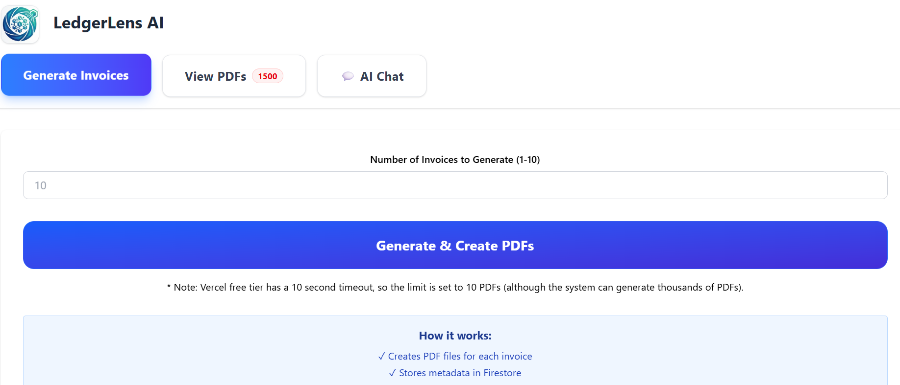
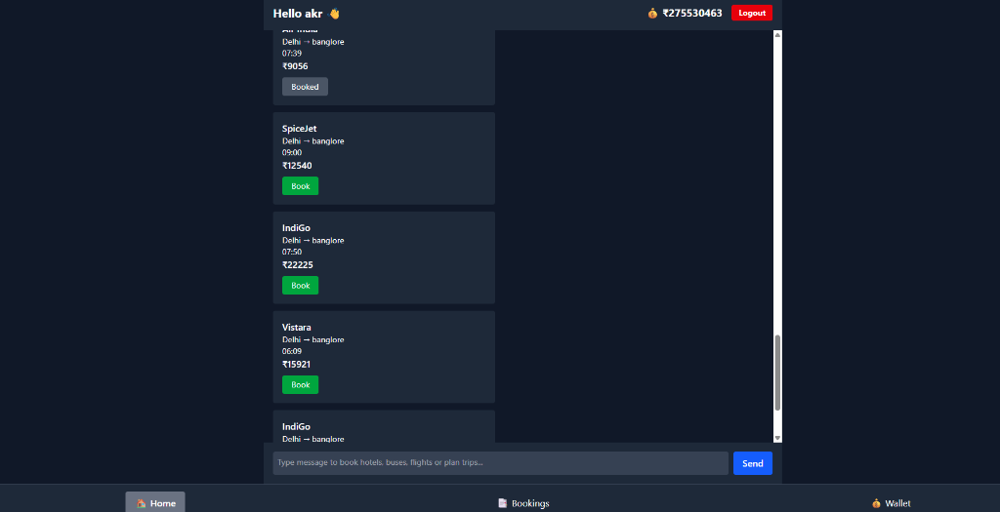

 

---

---

## 🚀 About Me

I'm a passionate **Full-Stack & Backend Developer** who loves building intelligent, real-world web applications. From designing scalable REST APIs to deploying AI-integrated platforms, I craft solutions that actually solve problems.

- 🔭 Currently working on AI-powered web apps
- 🌱 Deep-diving into **Backend System Design** & **Cloud Infrastructure**
- 💡 Love integrating AI APIs into production apps
- 📄 **<a href="https://drive.google.com/file/d/1vPCPRRBeKEnfCbeNKclTfW8My63yTaxo/view?usp=sharing" target="_blank">View My Resume</a>**

---

## 🛠️ Skills & Technologies

### 💻 Programming Languages

### ⚙️ Backend Development

### 🔌 API Development

### 🗄️ Databases & Cloud

### 🔐 DevOps & Security

---

## 🌟 Featured Projects

<table>
  <tr>
    <td width="33%" align="center">
      
        
      
        
      <strong>LeetLens</strong>
       
      AI coding intelligence platform focused on smarter problem-solving and learning workflows.
    </td>
    <td width="33%" align="center">
      
        
      
        
      <strong>LedgerLensAI</strong>
       
      Finance-focused AI experience for insight extraction, ledger understanding, and smarter reporting.
    </td>
    <td width="33%" align="center">
      
        
      
        
      <strong>TravoAI</strong>
       
      AI-powered travel planning platform — plan trips effortlessly with intelligent recommendations.
    </td>
  </tr>
</table>

---

## 📊 GitHub Stats

&nbsp;&nbsp;

 

---

## 🤝 Connect With Me

---

⭐ If you like what I build, consider starring my repos! Thanks for visiting 🙌

