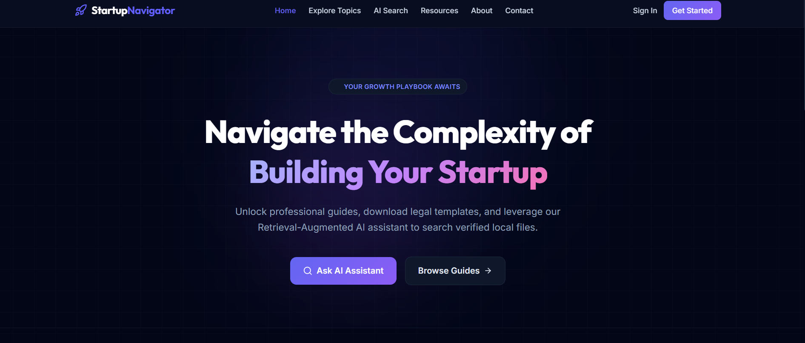
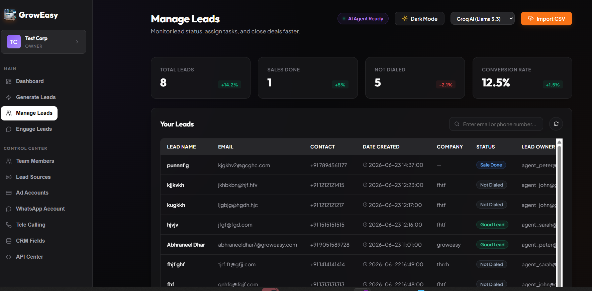
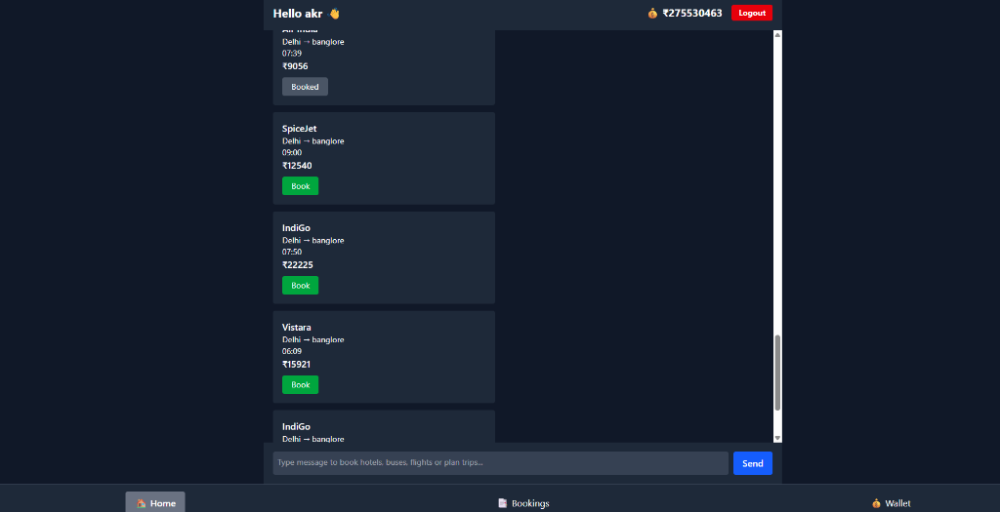
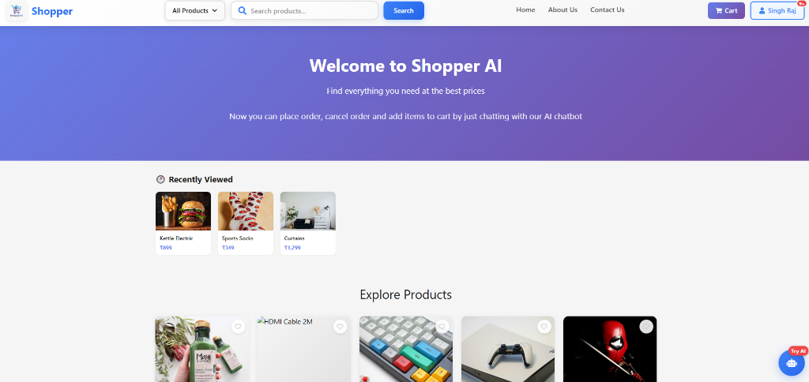
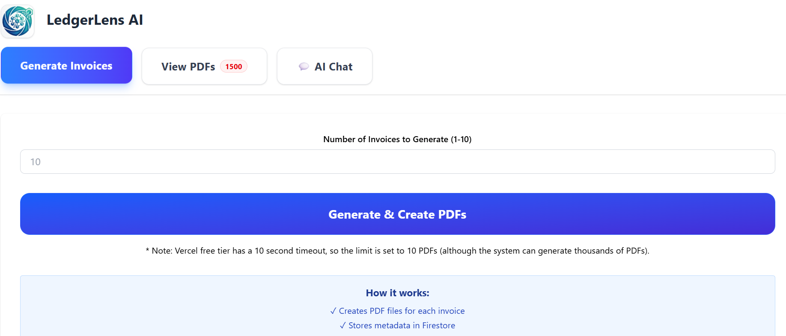
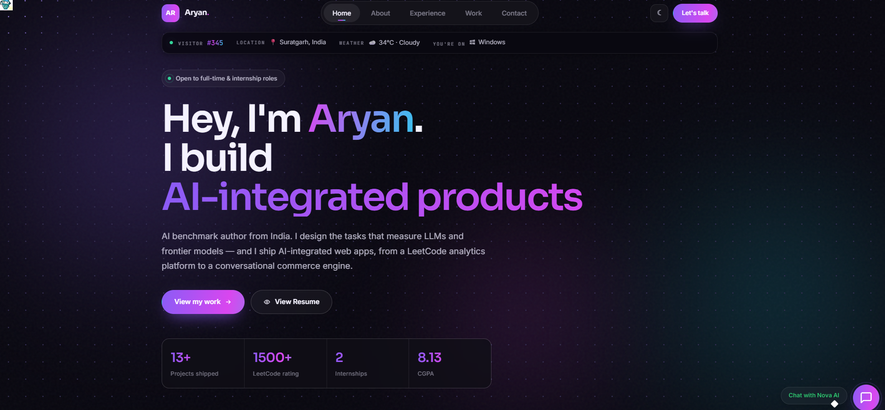

 

---

## 🚀 About Me

<table>
  <tr>
    <td align="center" width="28%">
      
        
      
       
      
       
      
    </td>
    <td width="72%">
      <h3>👋 Welcome to my digital workspace</h3>
      
I'm <b>Aryan Kumar Raj</b> — an <b>AI Benchmark Task Author</b>, <b>Software Engineer</b>, and <b>Full-Stack Developer</b>. By day I author and validate the evaluation benchmarks that measure how well frontier LLM agents can actually engineer software; by night I architect and ship production-grade AI products end to end.

      <ul>
        <li>🧪 <b>Currently:</b> AI Data Contributor at <b>Handshake AI</b> — authoring Software Engineering, Data Science, Debugging & Systems Infrastructure benchmarks for LLM agents</li>
        <li>⚙️ <b>Building:</b> Production AI platforms with <b>Next.js, React, Node.js, Groq, LangChain & LangGraph</b></li>
        <li>🏗️ <b>Deep in:</b> Backend system design, RAG pipelines, agentic architectures, Docker verification harnesses & cloud DevOps</li>
        <li>🎯 <b>Track record:</b> 2 internships · 12+ shipped projects · <b>2K+ users</b> tracked via custom-built analytics · 800+ DSA problems solved</li>
        <li>💡 <b>Philosophy:</b> Rigorous verification, clean architecture, and code that survives production</li>
      </ul>
    </td>
  </tr>
</table>

---

## 🧠 What I Do — AI Benchmark Task Authoring

<table>
  <tr>
    <td align="center" width="25%">
       
      Thread-safe <b>PostgreSQL Idempotency Ledger</b> in Python with atomic transactions & TTL eviction — <b>32/32 verifier tests passing</b>
    </td>
    <td align="center" width="25%">
       
      Harmonized multi-format telemetry (<b>CSV · JSONL · Parquet</b>) with cross-source identity resolution & pytest verifier suites
    </td>
    <td align="center" width="25%">
       
      Multi-threaded <b>C++/Node.js N-API</b> native addon — agents must resolve memory leaks & race conditions under load
    </td>
    <td align="center" width="25%">
       
      <b>Gröbner-basis</b> puzzle verified via Harbor oracle runs + <b>glibc→musl</b> dynamic linker migration task
    </td>
  </tr>
</table>

✅ Every task validated through <b>Docker-based Harbor agent oracles</b> and automated <b>GitHub Actions CI</b> — continuous evaluation, static analysis & performance profiling.

  

<b>🧰 My daily stack here</b> 
Python · C++ · Node.js N-API · PostgreSQL · pytest · Docker · Harbor oracles · GitHub Actions CI · Bash · Git — authoring and verifying agent tasks across security, mathematics & formal reasoning, data science, debugging & repair, systems infrastructure, build/release management, and regulated business operations.

---

## 🛠️ Tech Arsenal

  

<table>
  <tr>
    <td valign="top" width="50%">

### 💻 Languages

</td>
    <td valign="top" width="50%">

### 🎨 Frontend

</td>
  </tr>
  <tr>
    <td valign="top" width="50%">

### 🤖 AI & GenAI Engineering

</td>
    <td valign="top" width="50%">

### ⚙️ Backend & System Design

</td>
  </tr>
  <tr>
    <td valign="top" width="50%">

### 🗄️ Databases & Cloud

</td>
    <td valign="top" width="50%">

### 🔐 DevOps, Security & Tools

</td>
  </tr>
  <tr>
    <td valign="top" width="50%">

### 🧪 LLM Evaluation & Benchmarking

</td>
    <td valign="top" width="50%">

### 📊 Data Engineering & Analytics

</td>
  </tr>
  <tr>
    <td valign="top" width="50%">

### ⚡ Systems & Low-Level Engineering

</td>
    <td valign="top" width="50%">

### 🔐 Security & Supply Chain

</td>
  </tr>
  <tr>
    <td valign="top" width="50%">

### 🔢 Mathematics & Formal Reasoning

</td>
    <td valign="top" width="50%">

### 🧪 Testing & Quality Engineering

</td>
  </tr>
</table>

### 🧩 Core Computer Science

---

## 🏆 Achievements & Milestones

<table>
  <tr>
    <td align="center" width="25%">
      <h1>🥉</h1>
      <b>3rd Place</b> 
      HackTech 2025 Hackathon 
      among <b>100+ teams</b> — Team <i>Disaster Defenders</i> 
      Thapar Institute × Compucom, Kota
    </td>
    <td align="center" width="25%">
      <h1>⚔️</h1>
      <b>800+ DSA Problems</b> 
      Solved in <b>C++</b> 
      Peak LeetCode rating <b>1622</b> 
      <b>4★</b> on GeeksforGeeks
    </td>
    <td align="center" width="25%">
      <h1>👥</h1>
      <b>2K+ Users</b> 
      Visited across all my live projects 
      Measured through <b>custom-built analytics</b> engineered into every product
    </td>
    <td align="center" width="25%">
      <h1>✅</h1>
      <b>32/32 Verifiers</b> 
      Passed on my PostgreSQL Idempotency Ledger benchmark 
      Validated via Harbor oracles
    </td>
  </tr>
  <tr>
    <td align="center">
      <h1>🚀</h1>
      <b>12+ Projects Shipped</b> 
      Architected, deployed & maintained end-to-end in production
    </td>
    <td align="center">
      <h1>📈</h1>
      <b>329+ Users · 924+ Queries</b> 
      LeetLens platform analytics tracked via Firestore + Power BI
    </td>
    <td align="center">
      <h1>🎓</h1>
      <b>9.5 GPA</b> 
      Latest semester at RTU Kota B.Tech CSE · CGPA 8.24
    </td>
    <td align="center">
      <h1>⚡</h1>
      <b>35% Faster Renders</b> 
      Cut page render time 3.4s → 2.2s with 15+ reusable React components
    </td>
  </tr>
</table>

---

## 💼 Professional Experience

<table>
  <tr>
    <th width="26%">Role</th>
    <th width="24%">Organization</th>
    <th width="16%">Period</th>
    <th width="34%">Impact</th>
  </tr>
  <tr>
    <td><b>🧪 AI Data Contributor</b> Benchmark Task Author</td>
    <td><b>Handshake AI</b> Remote</td>
    <td>Jul 2026 — <b>Present</b></td>
    <td>Authoring SWE, Data Science, Debugging & Systems Infrastructure benchmarks for frontier LLM agents; validating via Docker Harbor oracles and GitHub Actions CI.</td>
  </tr>
  <tr>
    <td><b>🌐 Web Developer Intern</b></td>
    <td><b>Proscon Automation & Training Institute</b> Kota, Rajasthan</td>
    <td>Jun 2025 — Aug 2025</td>
    <td>Delivered <b>10+ features</b> and fixed <b>15+ bugs</b> in a 3-member Agile team; reviewed <b>15+ PRs</b>, accelerating delivery timelines by <b>20%</b>.</td>
  </tr>
  <tr>
    <td><b>⚛️ Web Development Intern</b></td>
    <td><b>Octanet Services Pvt Ltd</b></td>
    <td>May 2024 — Jul 2024</td>
    <td>Built <b>15+ reusable React components</b>, cutting page render time from <b>3.4s → 2.2s</b> by profiling bottlenecks in Chrome DevTools.</td>
  </tr>
</table>

---

## 🌟 Featured Projects

<table>
  <tr>
    <td width="50%" align="center" valign="top">
      
        
      
      
        
      <strong>Nxt Ventures — Startup Navigator</strong>
       
      Full-stack AI startup-validation engine built on a custom <b>JSON Atomic Database</b> — a vectorless RAG pipeline delivering explainable, citation-backed recommendations. <b>LangChain + LangGraph</b> orchestrate parallel agents that research, analyze and quantitatively score ideas, plus modules for unit economics, break-even and investment feasibility.
        
      
      
      
      
        
    </td>
    <td width="50%" align="center" valign="top">
      
        
      
      
        
      <strong>LeetLens — AI Coding Intelligence</strong>
       
      Production platform on <b>AWS EC2</b> with Nginx reverse proxy, custom domain and Let's Encrypt SSL. Google OAuth 2.0 + JWT auth, <b>Razorpay</b> live payments with signature verification, GraphQL + Groq LLM over an <b>MCP-compliant</b> architecture, and a React/Firestore analytics dashboard — <b>329+ users, 924+ AI searches</b>.
        
      
      
      
      
        
    </td>
  </tr>
  <tr>
    <td width="50%" align="center" valign="top">
      
        
      
      
        
      <strong>GrowEasy AI</strong>
       
      AI-powered CSV import engine for messy lead data — smart field mapping, context preservation and resilient production import flows that survive malformed real-world spreadsheets.
        
      
      
      
        
    </td>
    <td width="50%" align="center" valign="top">
      
        
      
      
        
      <strong>Travo AI</strong>
       
      Conversational travel booking platform — natural-language mock booking of hotels, flights and buses with price/route filters, wallet-based transaction logic and persistent booking history. Deployed on AWS EC2 behind Nginx.
        
      
      
      
        
    </td>
  </tr>
  <tr>
    <td width="50%" align="center" valign="top">
      
        
      
      
        
      <strong>ShopperAI</strong>
       
      Conversational AI shopping assistant — search, order and cancel products through natural-language chat, with Google one-click sign-in, securely stored payment/address details in Firestore and real-time wallet balance in-chat.
        
      
      
      
        
    </td>
    <td width="50%" align="center" valign="top">
      
        
      
        
      <strong>LedgerLens AI</strong>
       
      Finance-focused AI platform for real-time insight extraction, automated ledger reconciliation and smarter enterprise reporting over unstructured financial documents.
        
      
      
      
        
    </td>
  </tr>
  <tr>
    <td colspan="2" align="center" valign="top">
       
      
        
      
      
        
      <strong>Personal Developer Portfolio</strong>
       
      My digital showcase — interactive project breakdowns, a built-in <b>Nova AI</b> chat assistant, live visitor/weather telemetry, system engineering deep-dives and the full technical journey.
        
    </td>
  </tr>
</table>

### 🧩 More Projects

<table>
  <tr>
    <th width="26%">Project</th>
    <th width="44%">What it does</th>
    <th width="18%">Stack</th>
    <th width="12%">Links</th>
  </tr>
  <tr>
    <td><b>🗳️ DigiVote</b></td>
    <td>Biometric e-voting system with a companion mobile app — integrates <b>Mantra MFS fingerprint hardware</b> to verify voters against MongoDB-stored voter ID records.</td>
    <td>MERN · React Native · AWS</td>
    <td></td>
  </tr>
  <tr>
    <td><b>📑 Insurance Policy Assistant</b></td>
    <td>AI-powered PDF question-answering API — ingests policy documents and answers natural-language queries with grounded citations.</td>
    <td>Python · FastAPI · Gemini</td>
    <td></td>
  </tr>
  <tr>
    <td><b>🤖 LeetCode Analyzer Bot</b></td>
    <td>Telegram bot that pulls LeetCode profile stats on demand and reports progress and solve-rate breakdowns straight into chat.</td>
    <td>Node.js · Telegram API</td>
    <td></td>
  </tr>
  <tr>
    <td><b>⚔️ Moglix Engineering Solutions</b></td>
    <td>Competitive C++ solution set built for a timed engineering challenge — algorithmic problem solving under constraints.</td>
    <td>C++</td>
    <td></td>
  </tr>
  <tr>
    <td><b>📊 LedgerLens AI</b></td>
    <td>Finance AI platform for real-time insight extraction, automated ledger reconciliation and enterprise reporting over unstructured documents.</td>
    <td>Next.js · LLM · Vercel</td>
    <td></td>
  </tr>
</table>

📂 More work in progress over at <a href="https://github.com/aryan8434?tab=repositories" target="_blank" rel="noopener noreferrer"><b>my repositories</b></a>.

---

## 🎓 Certifications & Credentials

<table>
  <tr>
    <th width="42%">Credential</th>
    <th width="28%">Issuer</th>
    <th width="14%">Date</th>
    <th width="16%">Proof</th>
  </tr>
  <tr>
    <td><b>The Complete Full-Stack Web Development Bootcamp</b> 62 hours · Dr. Angela Yu</td>
    <td></td>
    <td>May 2026</td>
    <td></td>
  </tr>
  <tr>
    <td><b>Complete Linear Regression Analysis in Python</b> 7.5 hours · Start-Tech Academy</td>
    <td></td>
    <td>Apr 2024</td>
    <td></td>
  </tr>
  <tr>
    <td><b>CSS & JavaScript Complete Course</b> 4 hours · Proper Dot Institute</td>
    <td></td>
    <td>Oct 2023</td>
    <td></td>
  </tr>
  <tr>
    <td><b>Web Development Internship</b> 2-month industry internship · ISO 9001 certified</td>
    <td></td>
    <td>May–Jul 2024</td>
    <td></td>
  </tr>
  <tr>
    <td><b>Frontend Development Training Program</b></td>
    <td></td>
    <td>Jun 2024</td>
    <td></td>
  </tr>
  <tr>
    <td><b>Web Development Training</b> Govt. of Rajasthan registered institute</td>
    <td></td>
    <td>Jun–Aug 2025</td>
    <td></td>
  </tr>
  <tr>
    <td><b>HackTech 2025 Hackathon</b> 🥉 Team <i>Disaster Defenders</i> · AidAlert disaster-relief app</td>
    <td></td>
    <td>Feb 2025</td>
    <td></td>
  </tr>
  <tr>
    <td><b>Ode2Code 3.0 — Coding Competition</b></td>
    <td></td>
    <td>2023</td>
    <td></td>
  </tr>
</table>

---

## 🎓 Education

<table>
  <tr>
    <td align="center" width="20%"><h1>🏛️</h1></td>
    <td width="80%">
      <b>Bachelor of Technology — Computer Science & Engineering</b> 
      <b>Rajasthan Technical University</b>, Kota, Rajasthan · 2022 – 2026 
      📊 <b>CGPA 8.24</b> · Latest semester <b>GPA 9.5</b> 
      📚 Data Structures & Algorithms · Object-Oriented Programming · Operating Systems · Computer Networks · DBMS · Software Engineering (Agile, SDLC)
    </td>
  </tr>
</table>

---

## 📊 GitHub Analytics

  

&nbsp;

  

---

## 🤝 Let's Connect & Collaborate

💡 <b>Open to Software Engineer / Full-Stack / AI Engineering roles — and always up for a conversation about LLM evaluation, agentic architectures, or backend system design.</b>

  

📍 Bengaluru, India — open to relocation

---

⭐ If my projects or architecture taught you something, a star goes a long way. Thanks for visiting! 🙌

